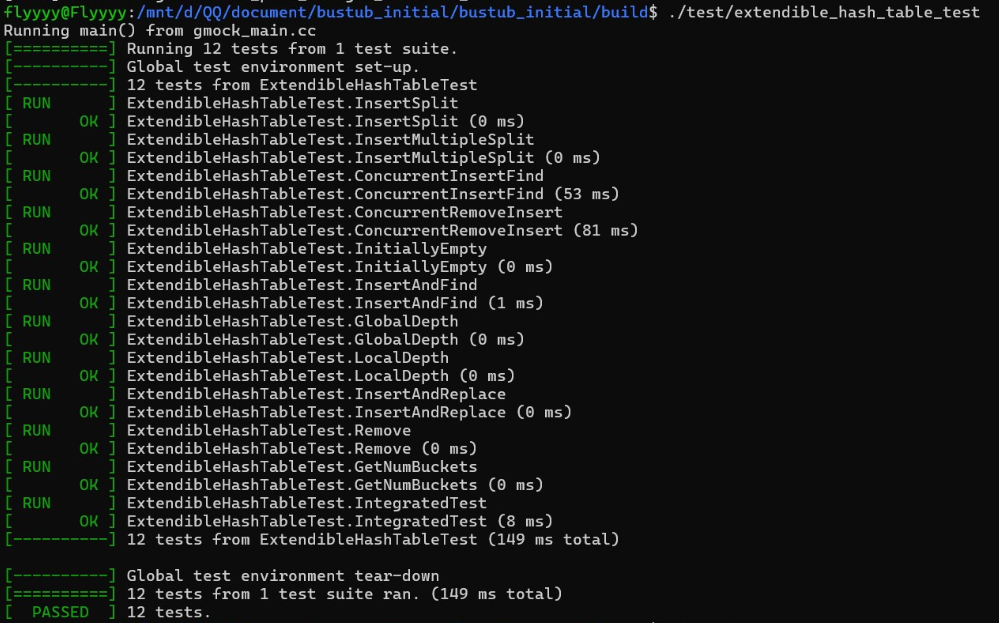
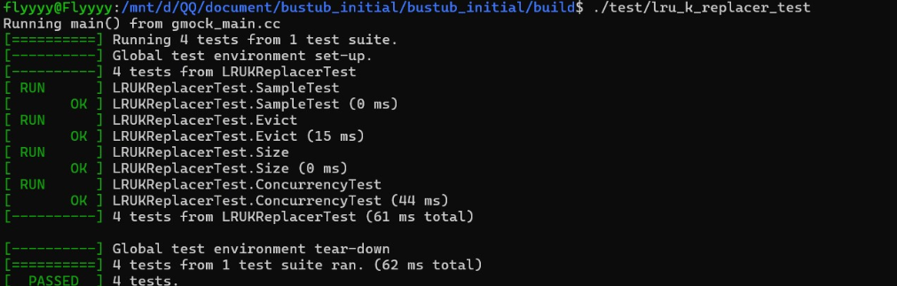
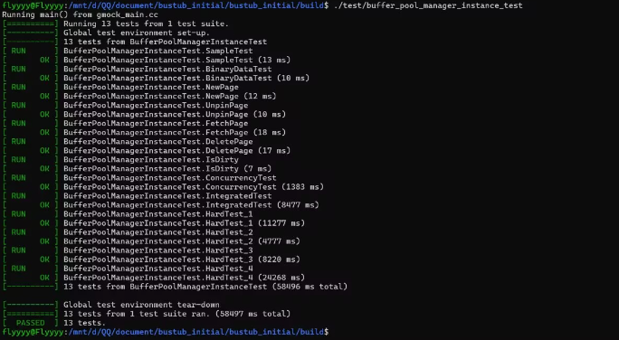
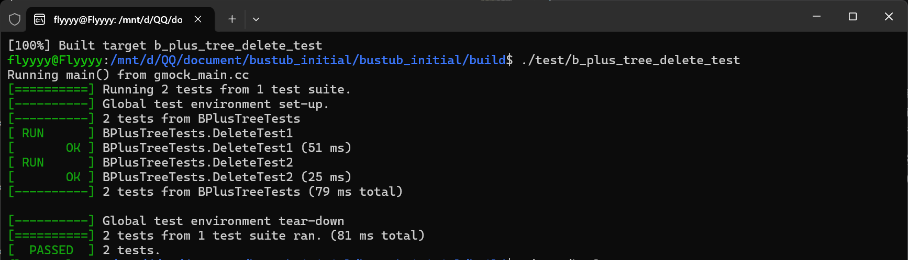
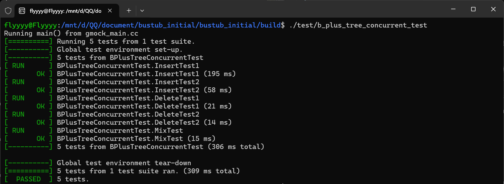
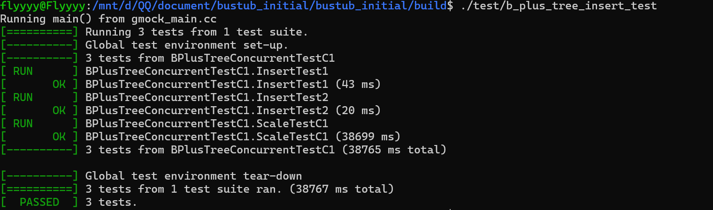
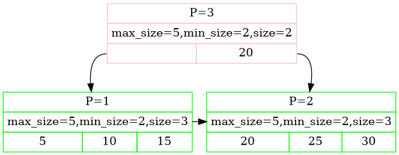

# DBSPwork
数据库作业  
小组成员：郭瑞均 *2023141460296* 王鹏飞 *2023141460278*  
- 数据库作业
  - 第一次作业
    - [`extensible_hash_test`](#extensible_hash_test)
    - [`lru_replacer_test`](#lru_replacer_test)
    - [`buffer_pool_manager_test`](#buffer_pool_manager_test)
  - 第二次作业
    - [`b_plus_tree_delete_test`](#b_plus_tree_delete_test)
    - [`b_plus_tree_concurrent_test`](#b_plus_tree_concurrent_test)
    - [`b_plus_tree_insert_test`](#b_plus_tree_insert_test)   
    - [`B+树结构示例`](#B+树结构示例)

### 第一次作业

#### `extensible_hash_test`

#### `lru_replacer_test`

#### `buffer_pool_manager_test`

### 第二次作业

#### `b_plus_tree_delete_test`

#### `b_plus_tree_concurrent_test`

#### `b_plus_tree_insert_test`

#### B+树结构示例

